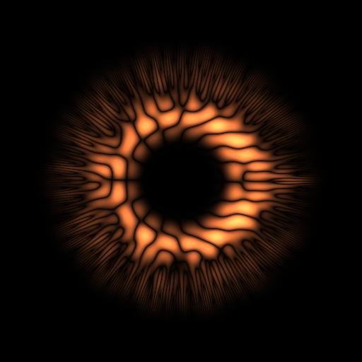
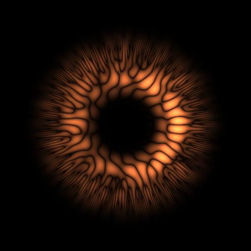
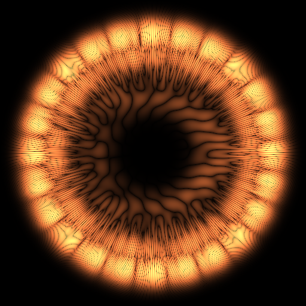

# Intro

The idea behind SoundShader is that sound is interference of simple periodic shapes. This is what makes sound sound. What those shapes are is irrelevant, so long as they form a basis. This means that sound can be converted to an image or to an almost arbitrary shape by swapping the basis. Pictures below are made by swapping the standard `cos(w*t)` basis with a set of 2d functions periodic in spatial coordinates. If you could guess the new basis, you could restore the original audible sound. Try it out: [soundshader.github.io](https://soundshader.github.io/).

# How it works

1. It uses WebAudio to get the waveform and then runs FFT to decompose that waveform into frequency -> (amplitude, phase) spectrum. The phase component is what makes the shape visibly "alive".
2. The spectrum is written to a WebGL texture and fed to a GLSL fragment shader that reassembles the (amplitude, phase) pairs back into a shape, but this time the basis functions are different: they form a basis (although not orthogonal), are periodic in spatial dimensions, and reasonbly reflect their frequency and phase shift.

# License

AGPLv3
