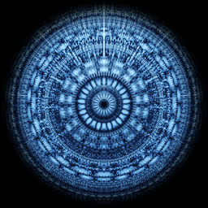
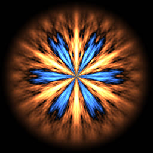
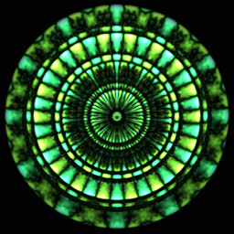
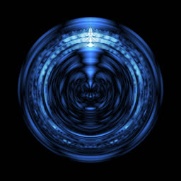

# Visualising sound with ACF

> _[Autocorrelation](https://pages.mtu.edu/~suits/autocorrelation.html) is used to compare a signal with a time-delayed version of itself. If a signal is periodic, then the signal will be perfectly correlated with a version of itself if the time-delay is an integer number of periods. That fact, along with related experiments, has implicated autocorrelation as a potentially important part of signal processing in human hearing._

 ACF is a simple method to visualize music that produces surprisingly good results. Perhaps the most unexpected property of ACF is that it accurately transfers the subjective "harmony level" from music to images. It's almost an unreasonable property, if you think about it. Images below are ACF height maps in polar coordinates.

Female vocal         | David Parsons        | Piano                   | Bird
-------------------- | -------------------- | ----------------------- | --------------------
 |  |    | 

More examples: [soundshader.github.io/gallery](https://soundshader.github.io/gallery/) (beware of large images).

Live demo: [soundshader.github.io](https://soundshader.github.io/)

A few related ideas:

1. [The AutoCorrelation Function](https://soundshader.github.io/acf)
1. [Gallery of ACF images](https://soundshader.github.io/gallery)
1. [Highres spectrograms with the DFT Shift Theorem](https://soundshader.github.io/hss/gallery)
1. [Wigner transform spectrograms](https://soundshader.github.io/hss/gallery/wigner)
1. [Vowels and colored ACF](https://soundshader.github.io/vowels)
1. [Cat meow sounds as colored ACF](https://soundshader.github.io/cats)
1. [The Lesser-Known Side of Discrete Cosine Transform](https://soundshader.github.io/pics/dct)
1. [Visual Morphology of Vowels](https://soundshader.github.io/acf-v2)

# License

AGPLv3. For any questions reach out to https://github.com/soundform.
