# Visual Morphology of Vowels

Demo: [soundshader.github.io/acf-v2](https://soundshader.github.io/acf-v2)

[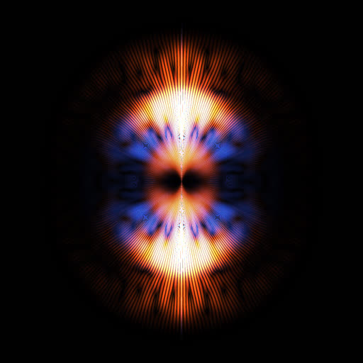](img/xl.jpg)

Image is clickable.

These images are auto-correlation spectrograms of vowels.

- Definition of auto-correlation: `ACF(X)=FFT[abs(FFT(X))^2]`. It splits input `X` into `amp*cos(freq*t+phi)` waves, drops phases `phi` and squares amplitudes `amp`. For this reason, `ACF(X)` is a symmetric function.
- The ACF images below render `abs(ACF(X))/max(abs(ACF(X)))` to avoid oversaturation. The ACF values aren't squared and aren't log10-scaled.
- Low frequencies and high frequencies are rendered with different colors by applying bandpass filters: `FFT[BPF*abs(FFT(X))^2]`. The low frequency ACF is rendered with color `(12,3,1)` and the high frequency ACF - with color `(1,3,12)`. Oversaturation allows to reveal more details without resorting to log10-scaling (which doesn't look good).
- Sample rate: 16 kHz. Frame size: 4096. The rule of thumb: frame size = 1/4 of sample rate. This means that one ACF frame captures 1/4 sec of sound, and the frames overlap heavily.
- The waveform is padded with zeros at both ends, to avoid abrupt edges on ACF images. In complex sounds, different frequencies fade out at different pace, which gives the distinctive shape to their ACF images.

Vowel sounds below taken from the [IPA table](https://en.wikipedia.org/wiki/Vowel) on Wikipedia. Tag "ncnfr" means [near-close near-front rounded](https://en.wikipedia.org/wiki/Near-close_near-front_rounded_vowel). Images are clickable.

[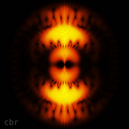](img/xl/cbr.jpg) [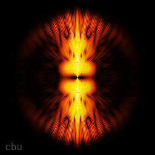](img/xl/cbu.jpg) [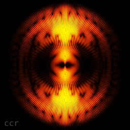](img/xl/ccr.jpg) [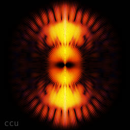](img/xl/ccu.jpg) [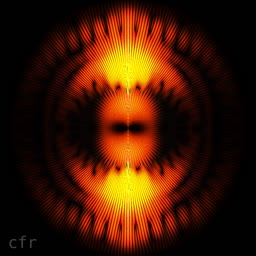](img/xl/cfr.jpg) [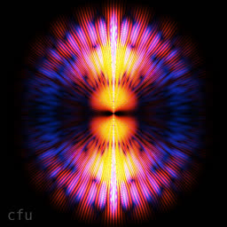](img/xl/cfu.jpg) [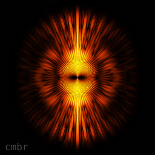](img/xl/cmbr.jpg) [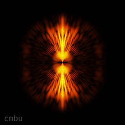](img/xl/cmbu.jpg) [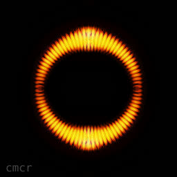](img/xl/cmcr.jpg) [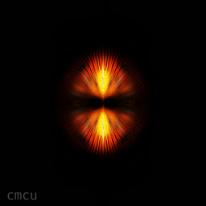](img/xl/cmcu.jpg) [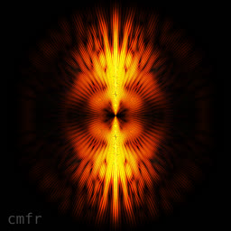](img/xl/cmfr.jpg) [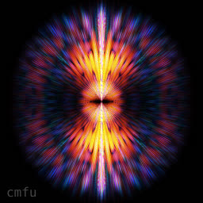](img/xl/cmfu.jpg) [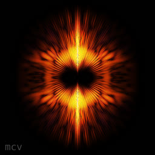](img/xl/mcv.jpg) [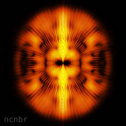](img/xl/ncnbr.jpg)  [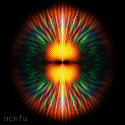](img/xl/ncnfu.jpg) [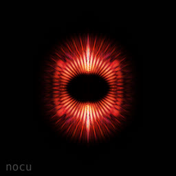](img/xl/nocu.jpg) [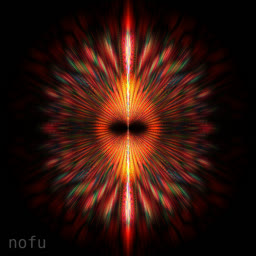](img/xl/nofu.jpg) [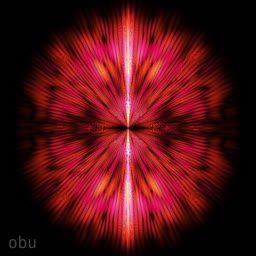](img/xl/obu.jpg) [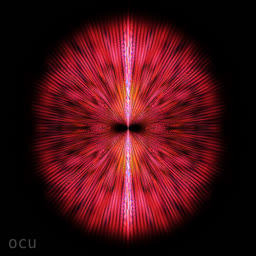](img/xl/ocu.jpg) [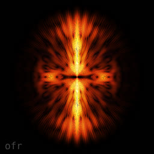](img/xl/ofr.jpg) [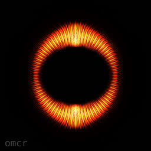](img/xl/omcr.jpg) [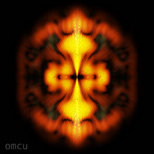](img/xl/omcu.jpg) [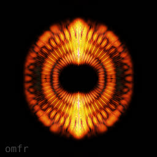](img/xl/omfr.jpg) [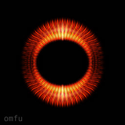](img/xl/omfu.jpg) [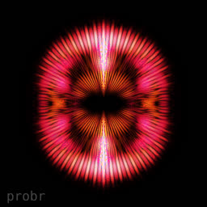](img/xl/probr.jpg) [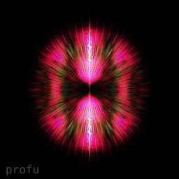](img/xl/profu.jpg) [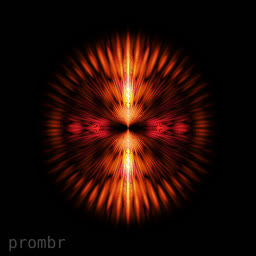](img/xl/prombr.jpg) [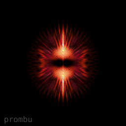](img/xl/prombu.jpg) 

10/2022
