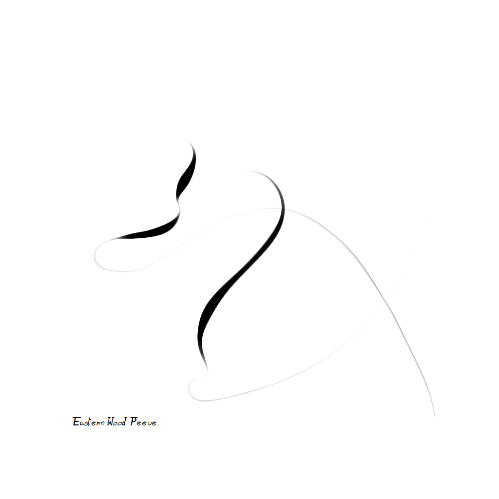
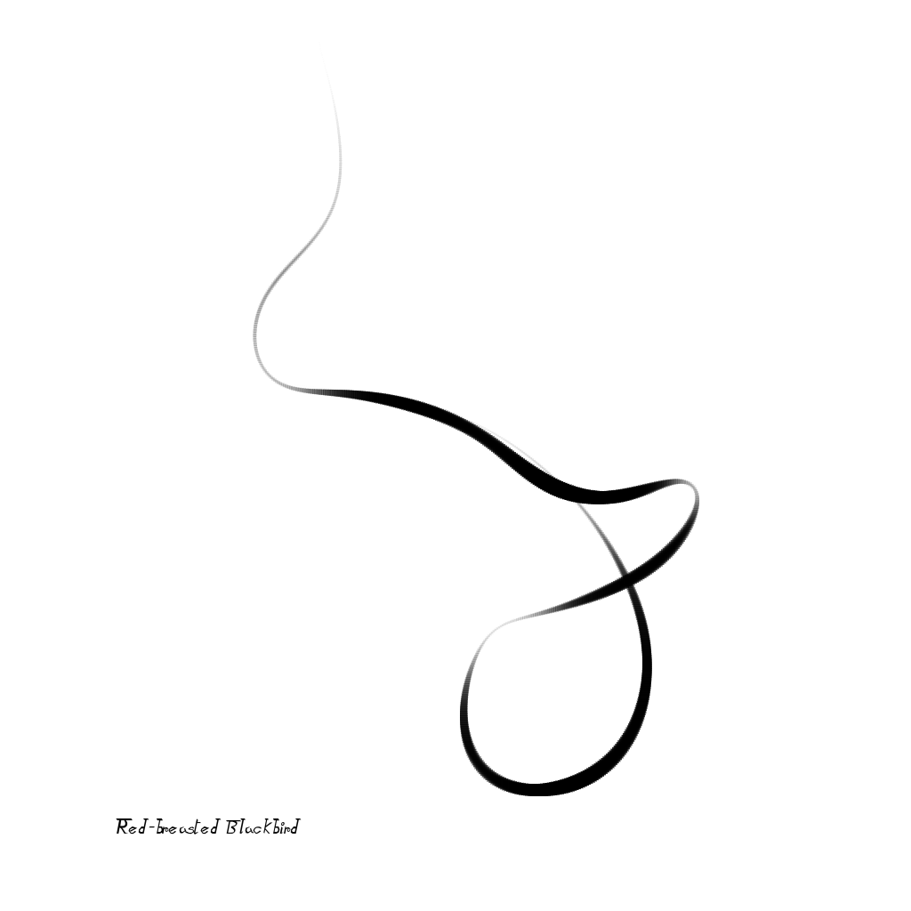
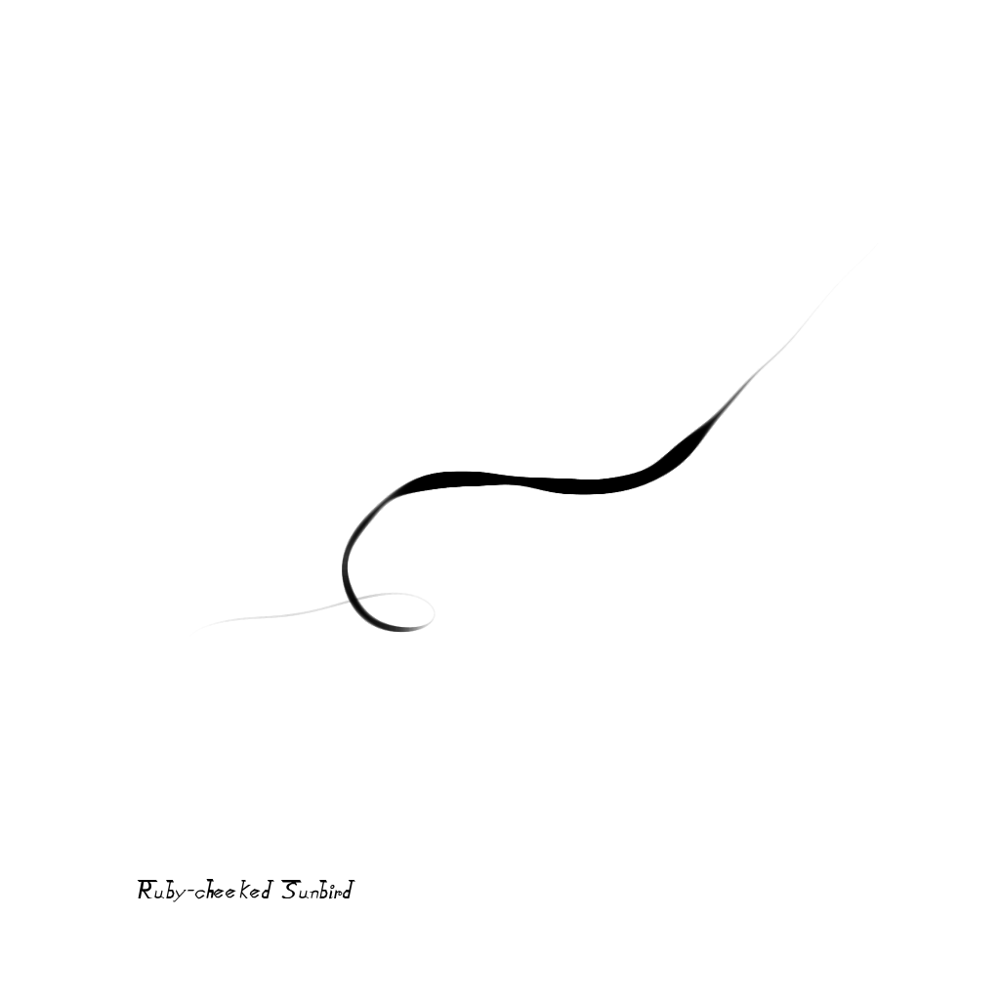
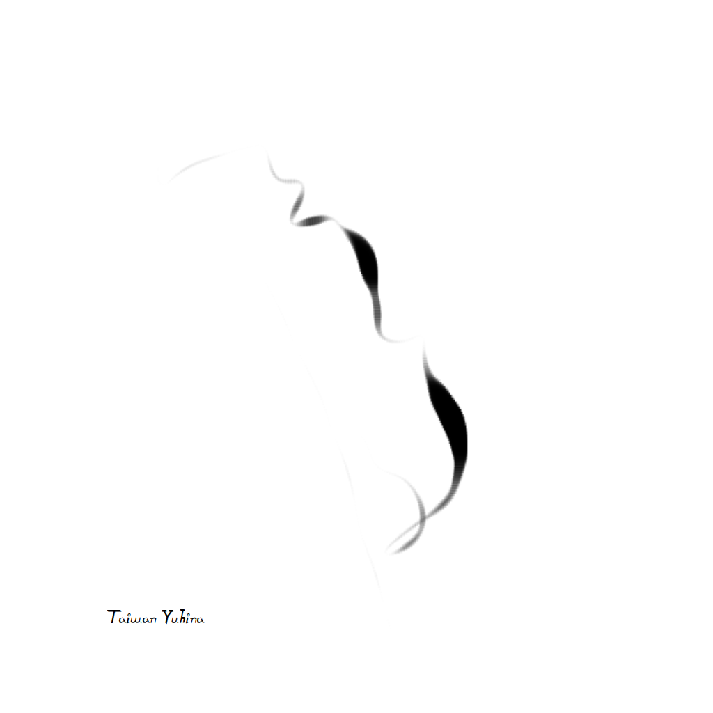
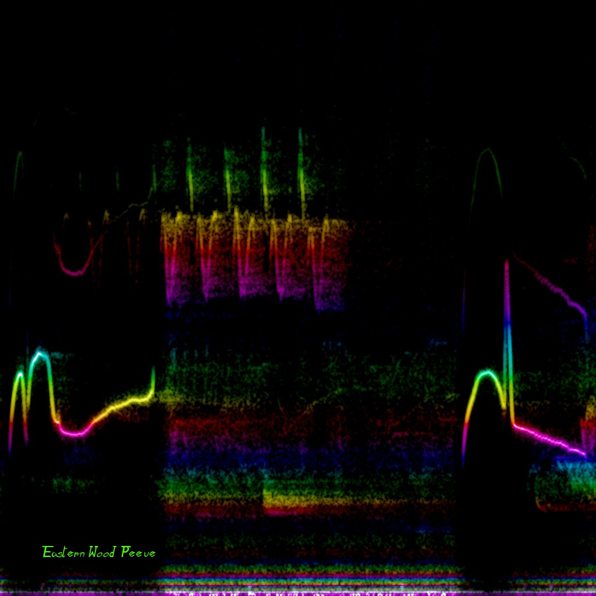

# Birdglyphs

Birdglyphs are spatial representation of birdsongs.

Click on the images to see the corresponding birdsongs on xeno-canto.org.

 | 
---- | ----
 | 

The top left image is a song of Eastern Wood Pewee. Here is its spectrogram:

When drawing a birdglyph, frequency on the spectrogram determines the direction, and amplitude determines the line thickness. A bird singing a 440 Hz note is going to draw a straight line going right, and if the bird starts raising the pitch, the line is going to curve up.

The Pevee's song has two distinct parts, each part drawing a different birdglyph. The relative placement of the birdglyphs is insignificant, and they can be drawn one on top of another, like on the picture in the top left.

Demo: https://soundshader.github.io/birdglyph (click on the empty space to upload a mp3 file). Some of the URL params to control its features:

- `?ss=2.3&to=4.1` selects only the 2.3s .. 4.1s range in the audio file. This is similar to the ffmpeg's params.
- `?fft=1` displays the spectrogram instead.
- `?sr=48` to use 48 kHz sample rate when computing FFT. Defaults to 12.

The demo uses WebAudio to decode audio files.

# License

AGPLv3
