# Cat meow sounds visualized as ACF images

I used the meow sounds from [https://soundspunos.com/animals/10-cat-meow-sounds.html](https://soundspunos.com/animals/10-cat-meow-sounds.html). I expected to see very little variability in the cat meow sounds, maybe just 4-5 different types for basic emotions. To my surprise, each "cat meow" has astonishingly colorful, complex and unique structure, unlike human vowels that follow a more or less predictable pattern: [https://soundshader.github.io/vowels](https://soundshader.github.io/vowels).

The algorithm behind these images is fairly simple. It computes FFT to decompose the sound into a set of `A·cos(2πwt+φ)` waves and drops the phase `φ` to align all `cos` waves together. This is known as the auto-correlation function (ACF). Before merging them back, it colorizes each wave using its frequency `w`: the A notes (432·2ⁿ Hz) become red, C notes - green, E notes - blue, and so on. Finally, it merges the colored and aligned `cos` waves back, using the amplitude `A` for color opacity, and renders them in polar coordinates, where the radial coordinate is time.

Interpreting ACF images:
1. Time progresses from the center to the edge of the circle.
1. Color means note, e.g. A4=432Hz is red, but so is A1, A2 and all other A notes. B is orange, C is yellow, D is green and so on.
1. The amount of fine details is frequency: the higher the frequency, the more fine details you see. If notes of different colors and different frequencies sound simultaneously, e.g. a A2 with a G5, you'll see a red belt with a few repetitions mixed with a blue belt with 8x more repetitions, so the result will be a purple belt with a fine structure.

For example, on one image below there is a green belt with 10 repetitions. One repetition correponds to 13.5 Hz here (55296 Hz sample rate, 4096 FFT bins), so 10 repetitions is 135 Hz, which corresponds to C3. On another image there is a curious red cross in the center, it's a red belt with 2 repetitons. That's 27 Hz, or A0, almost infrasound.

Demo: [https://soundshader.github.io/?n=4096&img=2048&acf.lr=5&sr=55.296](https://soundshader.github.io/?n=4096&img=2048&acf.lr=5&sr=55.296). With `C` on keyboard you can switch between polar and decart coords, and with Ctrl+Click and Shift+Click you can select the left and right boundary of the sound sample.

GitHub: https://github.com/soundshader/soundshader.github.io

## Domestic cats

[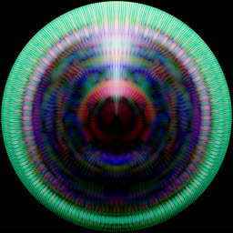](pics/cats/10.jpg) 
[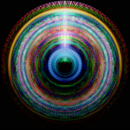](pics/cats/11.jpg) 
[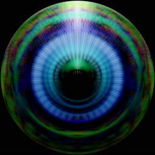](pics/cats/12.jpg) 
[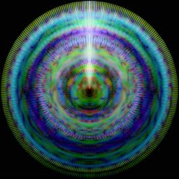](pics/cats/13.jpg) 
[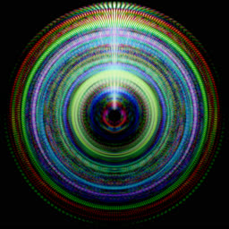](pics/cats/14.jpg) 
[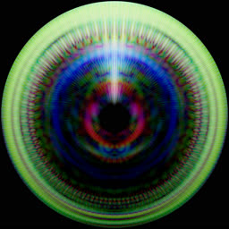](pics/cats/15.jpg) 
[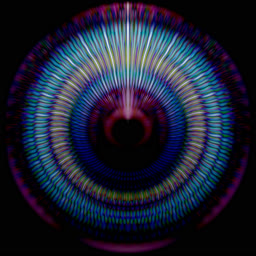](pics/cats/16.jpg) 
[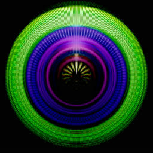](pics/cats/17.jpg) 
[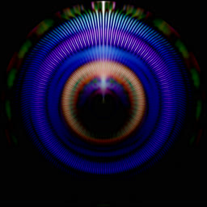](pics/cats/18.jpg) 
[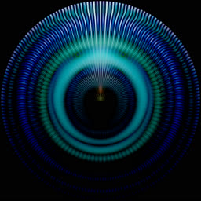](pics/cats/19.jpg) 
[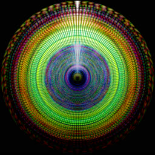](pics/cats/1.jpg) 
[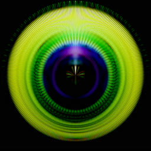](pics/cats/20.jpg) 
[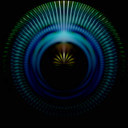](pics/cats/21.jpg) 
[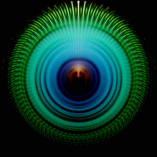](pics/cats/22.jpg) 
[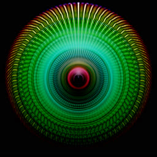](pics/cats/23.jpg) 
[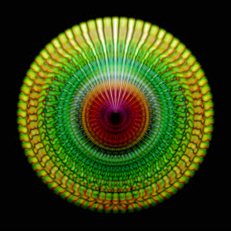](pics/cats/24.jpg) 
[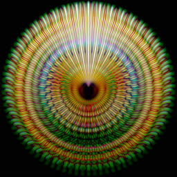](pics/cats/25.jpg) 
[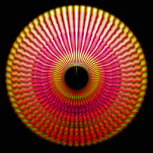](pics/cats/26.jpg) 
[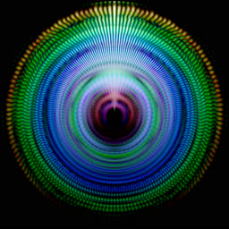](pics/cats/28.jpg) 
[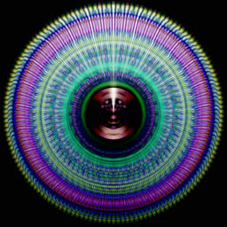](pics/cats/29.jpg) 
[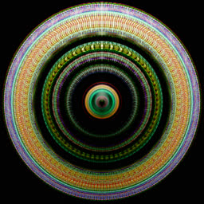](pics/cats/2.jpg) 
[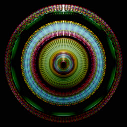](pics/cats/3.jpg) 
[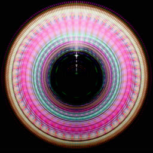](pics/cats/4.jpg) 
[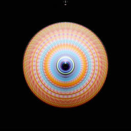](pics/cats/5.jpg) 
[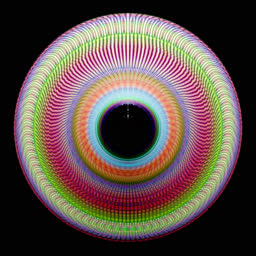](pics/cats/6.jpg) 
[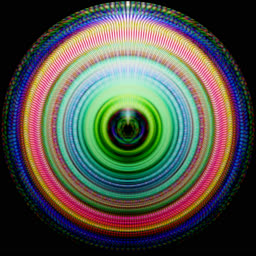](pics/cats/7.jpg) 
[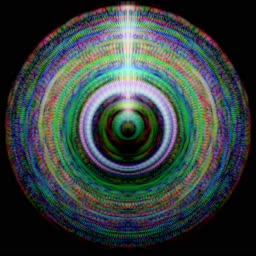](pics/cats/8.jpg) 
[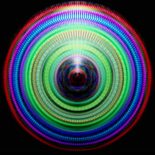](pics/cats/9.jpg) 

## Hissing noise

[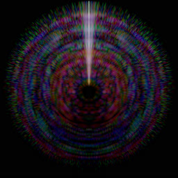](pics/cats/27.jpg) 

## Wild cats

[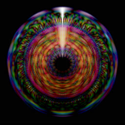](pics/cats/30.jpg) 
[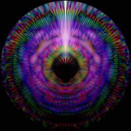](pics/cats/31.jpg) 
[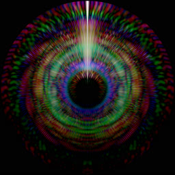](pics/cats/32.jpg) 

# License

AGPLv3
