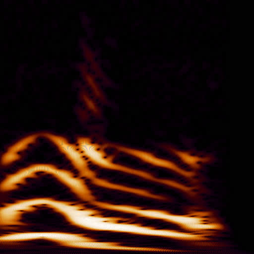

This is a GPU implementation of wavelet transform. It's pretty fast and it supports arbitrary wavelet functions. The default is a Morlet-like wavelet:

```glsl
  vec2 wavelet(float ts, float freq_hz) {
    float width = 25.0 / freq_hz + 0.025;
    float amp = 1.0 - hann_step(abs(float(ts)), 0.0, width * 0.5);
    float phase = ts * freq_hz * PI * 2.0;
    float re = cos(phase);
    float im = sin(phase);
    return amp / width * vec2(re, im);
  }
```

Below is a wavelet spectrogram of the [close-back rounded vowel](https://en.wikipedia.org/wiki/Close_back_rounded_vowel). 750 ms, 48 kHz. The image displays the 80-1500 Hz range. Brightness is a log10-scaled ampltidues, the displayed range is -2.5..0.5.

[](img/xl.jpg)

Click to see the 4096x4096 version.
