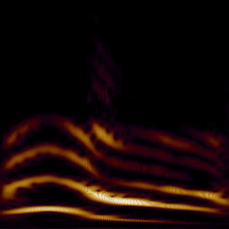
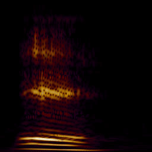
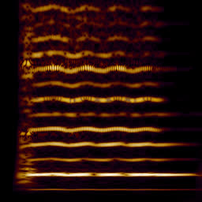
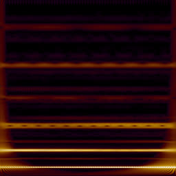
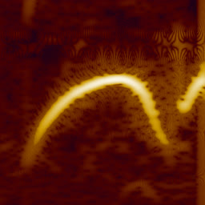
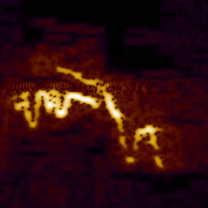

# Continuous Wavelet Transform with FFT

[soundshader.github.io/cwt](https://soundshader.github.io/cwt) renders wavelet spectrograms of audio files using a GPU version of FFT. The wavelet function is written in GLSL and can be edited in the UI. The default is a Morlet-like wavelet: instead of a gaussian, it uses the Hann window function.

```
  vec2 wavelet(float ts, float freq_hz) {
    float width = 25.0 / freq_hz + 0.025;
    float amp = 1.0 - hann_step(abs(float(ts)), 0.0, width * 0.5);
    float phase = ts * freq_hz * PI * 2.0;
    float re = cos(phase);
    float im = sin(phase);
    return amp / width * vec2(re, im);
  }
```

For each frequency, it aims to detect about 25 repetitions of the audio signal. The additional 25 msec are needed to even out the upper and lower frequencies.

Images are rendered row by row, as the audio signal is convolved with wavelets for each frequency separately. Even though FFT is used to perform each convolution in $N \log N$ steps, only `image_width` samples are used from the result and the rest is discarded. Thus the overall performance is $H N \log N$ where $H$ is image height and $N$ is audio signal length, 65536 samples by default. It doesn't depend on `image_width`. Compare this with the traditional STFT spectrogram: $W H \log H $, independent of $N$. I haven't figured how to efficiently compute STFT-style equally spaced wavelet spectrograms.

Brightness is computed by mapping a fixed range $\log_{10}|w|=-5..5$ of the spectrogram to $0..1$, and further mapping it to a simple palette with 5 colors, to give it a flame-like appearance. This is effectively the dB scaling.

One additional trick is replacing $e^{2 \pi i \omega t}$ with $\cos 2 \pi \omega t$ in the wavelet function. This captures the phase component on the spectrogram, while visually preserving its magnitude.

All computations are performed on GPU. The audio signal is kept in a `256x256x1` framebuffer. Each wavelet is kept in a separate `256x256x2` framebuffer (2 components for complex numbers). Both are transformed with a GPU-version of FFT, followed by a dot product and an inverse FFT. The result is a single row on the spectrogram.

```
S = conv(A, W) = iFFT(dot(FFT(A), FFT(W)))
```

Below are two vowels, a violin, a singing bowl and two birds. Click images to see the large versions.

[](v1.jpg)
[](v2.jpg)
[](v3.jpg)
[](v4.jpg)
[](v5.jpg)
[](v6.jpg)
