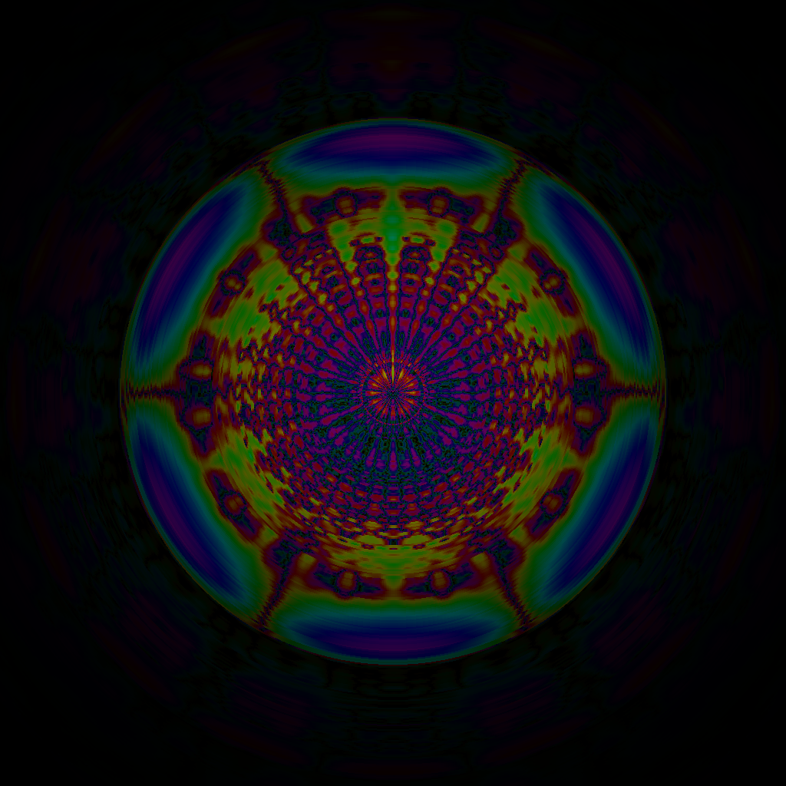
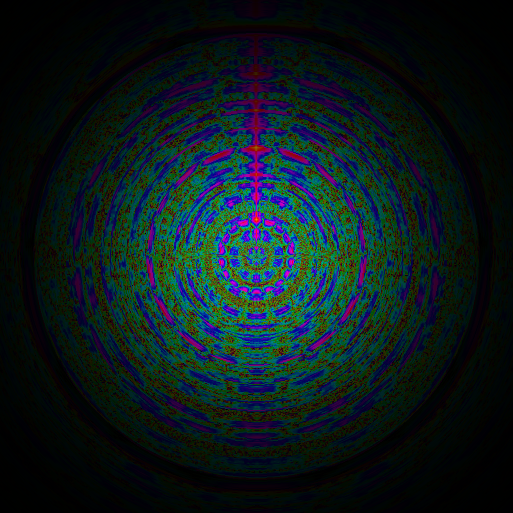

# The AutoCorrelation Function

ACF is a surprisingly simple method to visualize music that produces borderline magical results. Perhaps the most unexpected property of ACF is that it accurately transfers the subjective "harmony level" from music to images: if we could define a function `H(sound)` that gives `0` to the ugliest sound possible (e.g. nails on chalkboard) and `1` to the most harmonical sound you could imagine, and similar for images, then it seems that `H(sound) = H(ACF(sound)) + epsilon`, where `ACF(sound) = image`. It's almost an unreasonable property, if you think about it.

Live demo: https://soundshader.github.io/?s=acf

First, a few examples from David Parsons:

Now a few soundtracks from Quake 2:

Nothing wrong with Quake 2, but its soundtracks are objectively messy, and you can see that on the ACF images.

# So how does it work?

Any guesses?
