# The AutoCorrelation Function

ACF is a simple method to visualize music that produces surprisingly good results. Perhaps the most unexpected property of ACF is that it accurately transfers the subjective "harmony level" from music to images. If we could define a function `H(sound)` that gives `0` to the ugliest sound possible (e.g. nails on chalkboard) and `1` to the most harmonical sound, and similar for images, then it seems that `H(sound) = H(ACF(sound))`, where `ACF(sound) = image`. It's almost an unreasonable property, if you think about it.

Live demo: [https://soundshader.github.io/?s=acf](https://soundshader.github.io/?s=acf)

First, a few examples from David Parsons:

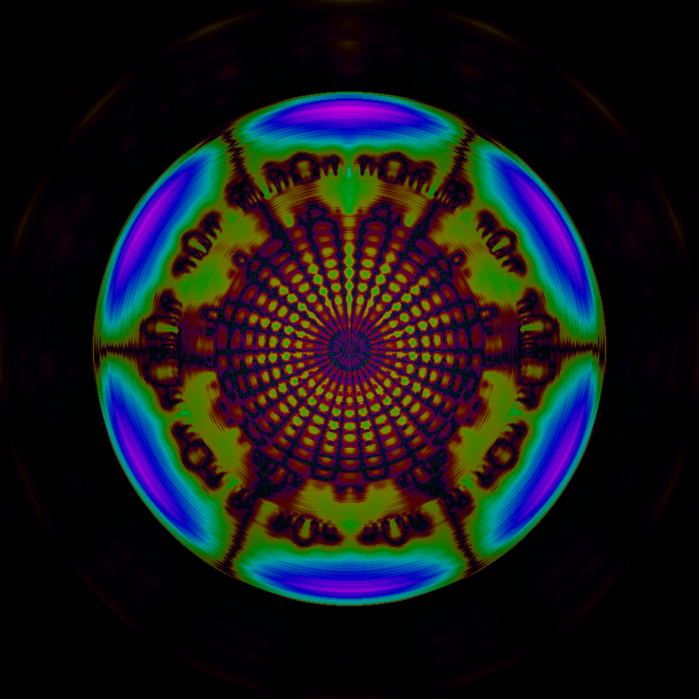

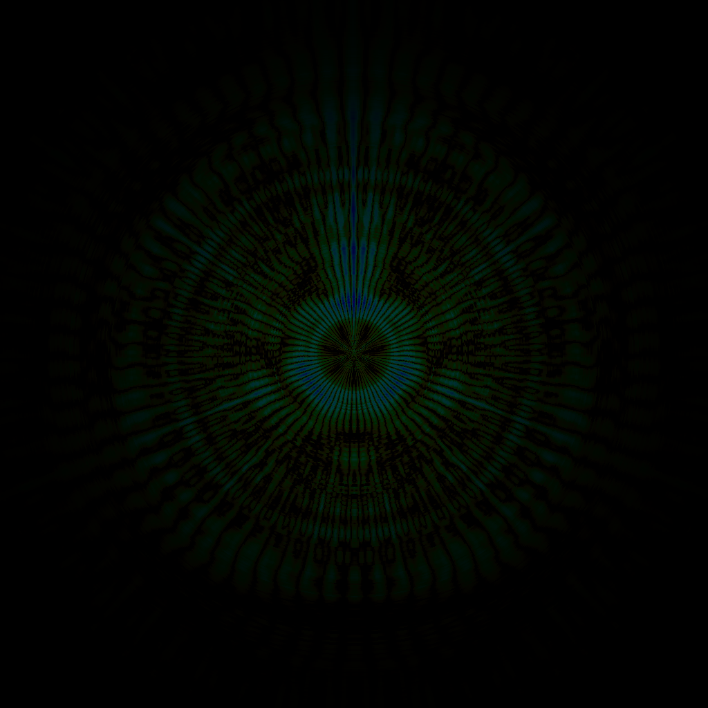

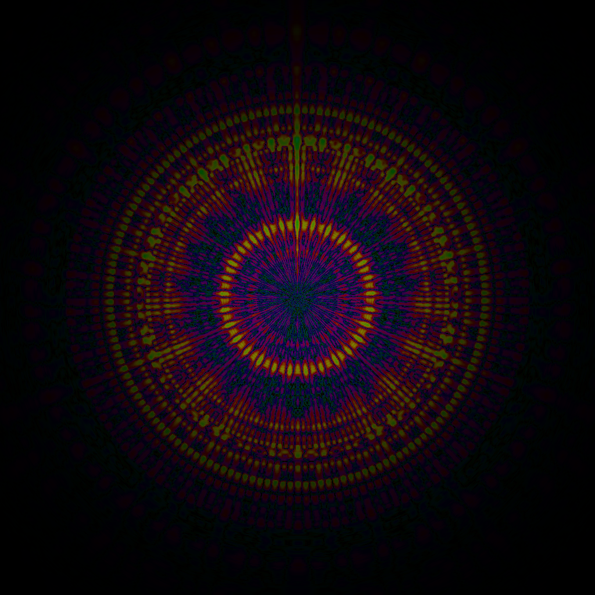

Now a few soundtracks from Quake 2:

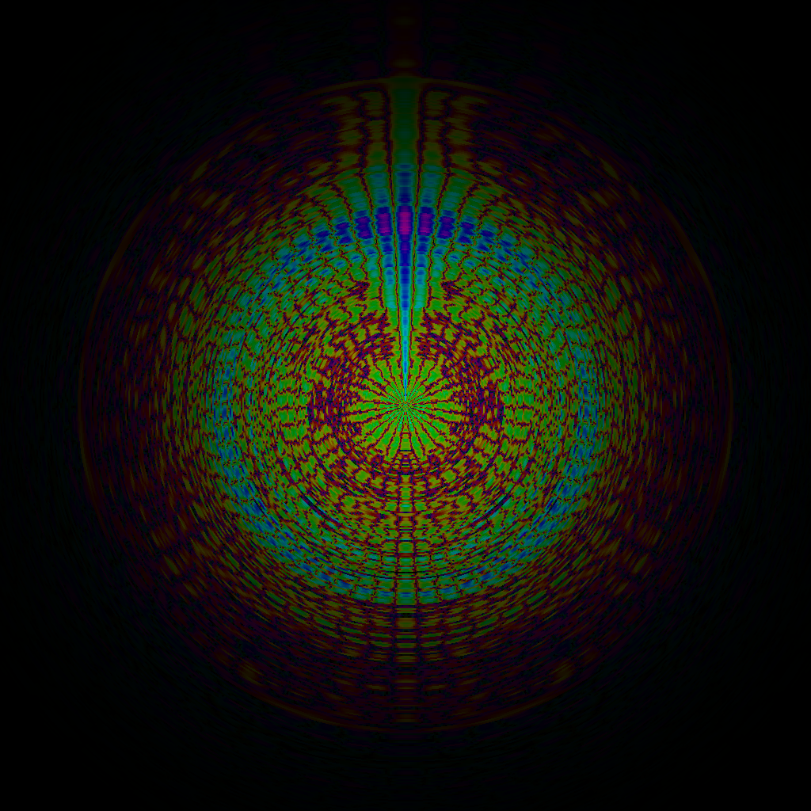

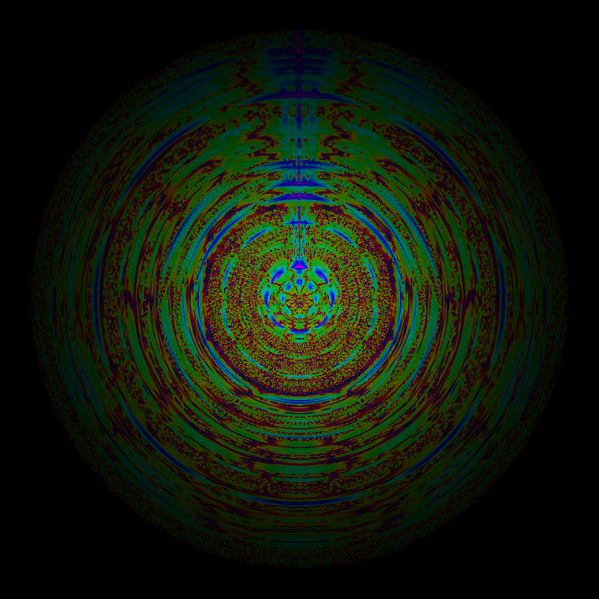

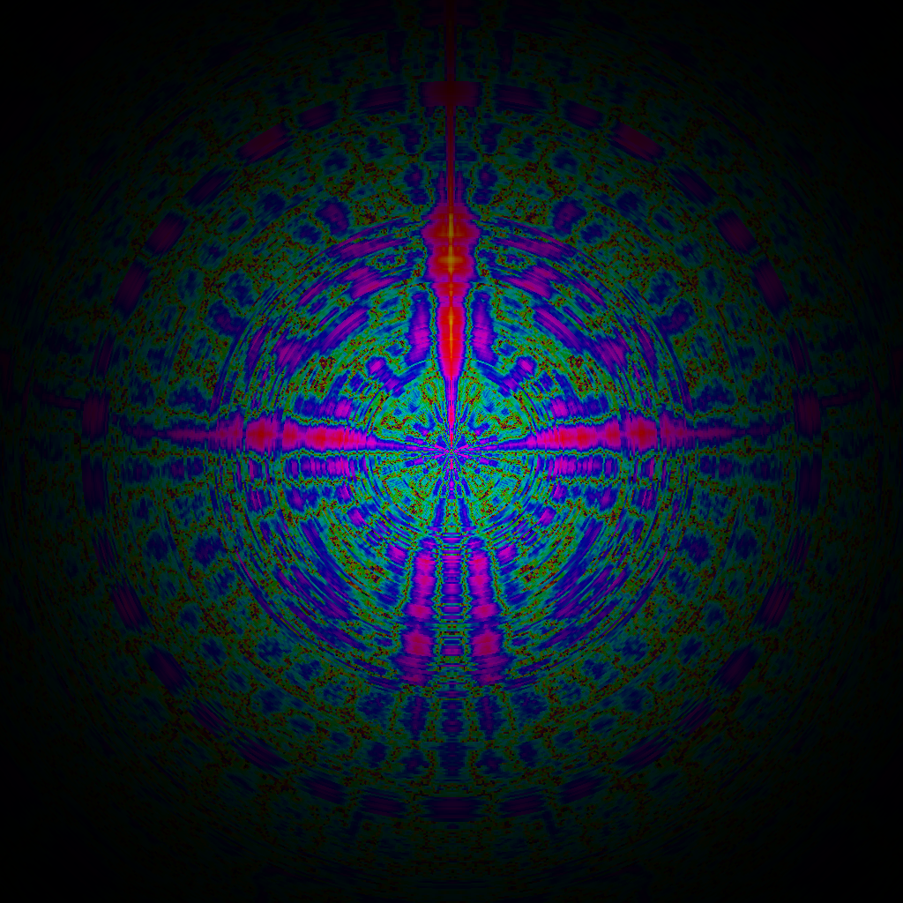

And some club music:

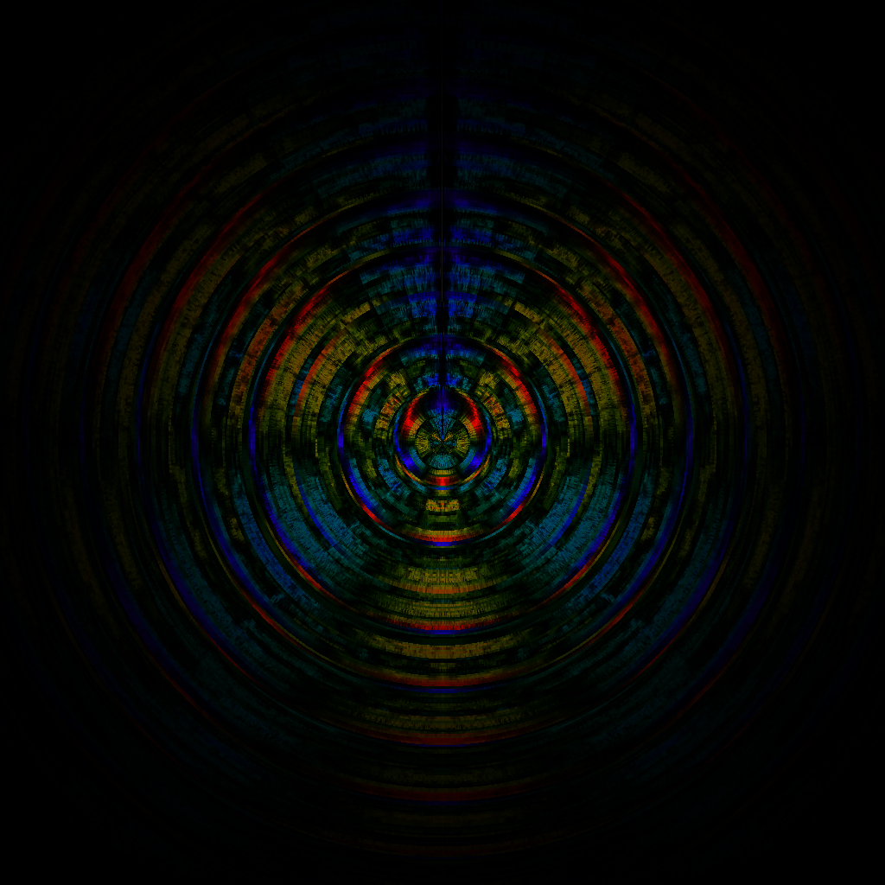

Just by looking at these images we can make a good guess how the musical pieces behind them sound.

# Why ACF matches our perception of sound

Contrary to what you might think, our ears don't seem to rely on an FFT-like process to extract isolated frequencies. Instead, our ears detect periodic parts in the signal, although in most cases those periodic parts closely match the FFT frequencies. There is a simple [experiment](https://auditoryneuroscience.com/pitch/missing-fundamental-stimuli) that proves this point:


As can be clearly seen on the FFT image, the A signal is a pure sinusoidal tone, while B is a mix of tones. Despite each tone in B is higher than A, our ears perceive B as a lower tone. However if we plot both waveforms, we'll see that A has about 9 peaks in a 20 ms window, while B has only 5. The definition of "peak" is moot, but it doesn't stop our ears from counting them and using the "number of peaks per second" as a proxy to the tone height.

ACF detects those peaks. ACF sees that there are 5 equally spaced time shifts where `B[t] * B[t + shift]` reaches the maximum, so on the ACF output we'll see those 5 peaks.

> Given that I've shamelessly stolen the experiment's illustration above, I feel obligated to recommend the book where the illustration came from: [Auditory Neuroscience](https://auditoryneuroscience.com/book-preview).

One downside of ACF is that it drops the phase component of the input signal, and thus ACF is not reversible. This means that images that only render ACF, lose about 50% of the information from the sound and those 50% are important, e.g. dropping the phase from recorded speech makes that speech indiscernible. Real world sounds, such as voice, heavily use nuanced amplitude and phase modulation. ACF captures the former, but ignores the latter.

# Visualizing ACF

ACF of a sound sample `X[i]` can be computed using just FFT:

```
Y = FFT[X]
S[i] = |Y[i]|^2
ACF[X] = FFT[S]
```

And thus ACF contains exactly the same information as the spectral density `S` (the well known spectrogram), but presented in a periodic form.

> If you're familiar with the ACF definition, you'll notice that I should've used the inverse FFT in the last step. There is no mistake. The inverse FFT can be computed as `FFT[X*]*`, where `X*` is conjugation, but since `S[i]` is real-valued (and positive, in fact), the conjugate has no effect on it, and since ACF is also real valued in this case, the second conjugate has no effect either.

ACF is a periodic function and so can be naturally rendered in polar coordinates. In most cases, ACF has a very elaborate structure. Below are some examples, where red = ACF > 0 and blue = ACF < 0.

Looking at the first example, we can tell that there are 5 prominent peaks in a 20 ms sound sample, which corresponds to 250 Hz. This means that our ears will necesserarily perceive this sound as a 250 Hz tone, regardless of what its spectrogram says. If it was a pure 250 Hz tone, we'd see perfectly round shapes of the `r = cos(250Hz * t)` line, but it's not the case here: we see that the 5 peaks are modulated with small wavelets: there is one big wavelet in the middle (which consists of 3 smaller wavelets) and 4 smaller wavelets. Our ears will hear the big wavelet as the 2nd harmonic of the 250 Hz tone (i.e. it will be a 500 Hz tone with a smaller amplitude) and the 4 small wavelets as the 5th harmonic (1000 Hz) at barely discernible volume. In addition to that, the 500 Hz harmonic is also modulated by the 3 tiny wavelets, which means we'll hear a 1500 Hz tone, almost inaudible. We can say all this without even looking at the spectrogram or hearing the sound.

> There is also a peculiar assymetry between red and blue wavelets, as well as between the small wavelets on the 5 peaks. I don't know what audible effect this corresponds to.


Sometimes ACF can be strictly positive:


IIRC, this is ACF of a bird song:


The naive approach to render ACF would be to assign a color brightness to the ACF amplitude. While this would capture all the information, our eyes won't see the 2% pixel to pixel variations in color brightness, so all the small wavelets that correspond to harmonics will be lost.

Instead, we could assign color not only to the ACF magnitude, but also to the magnitude of its gradient `ACF'[i]`. This is going to capture all the wavelets. In theory, we could also consider capturing the 2nd derivative `ACF''[i]`, although I don't know if this would capture any audible properties of sound.

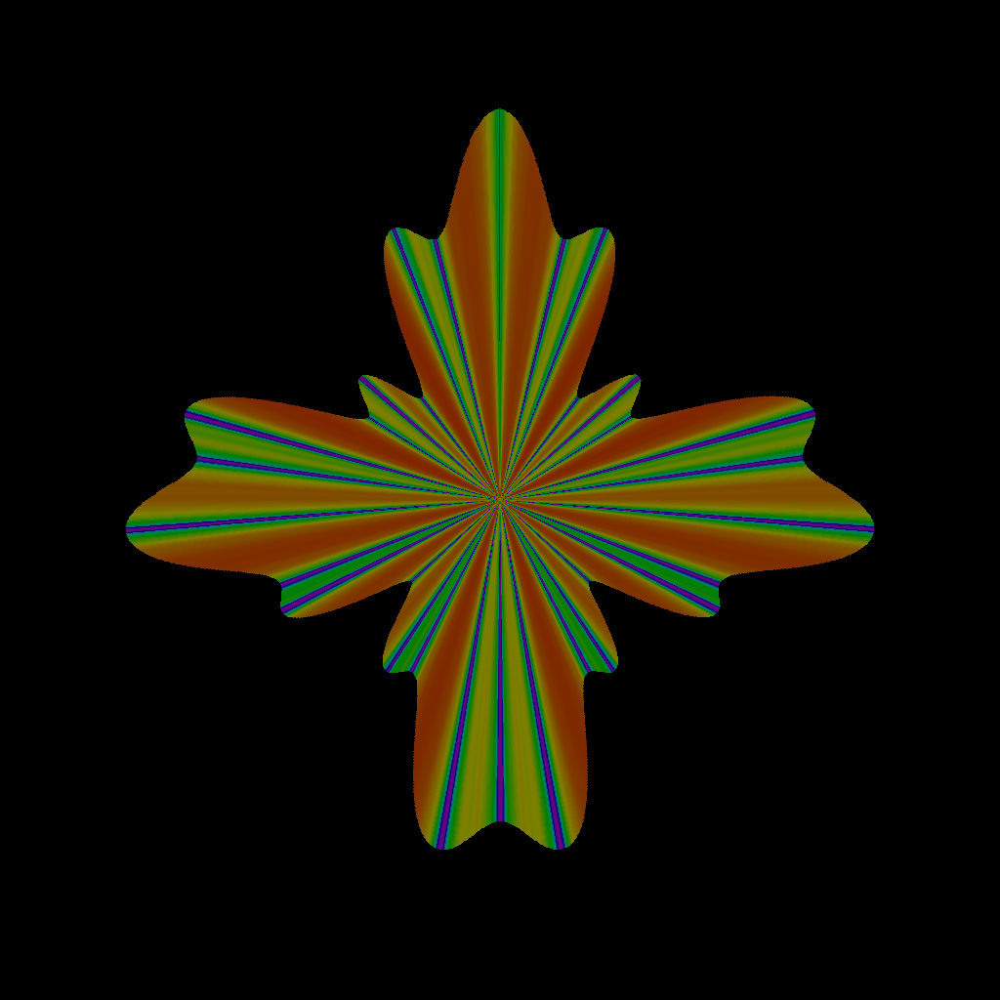

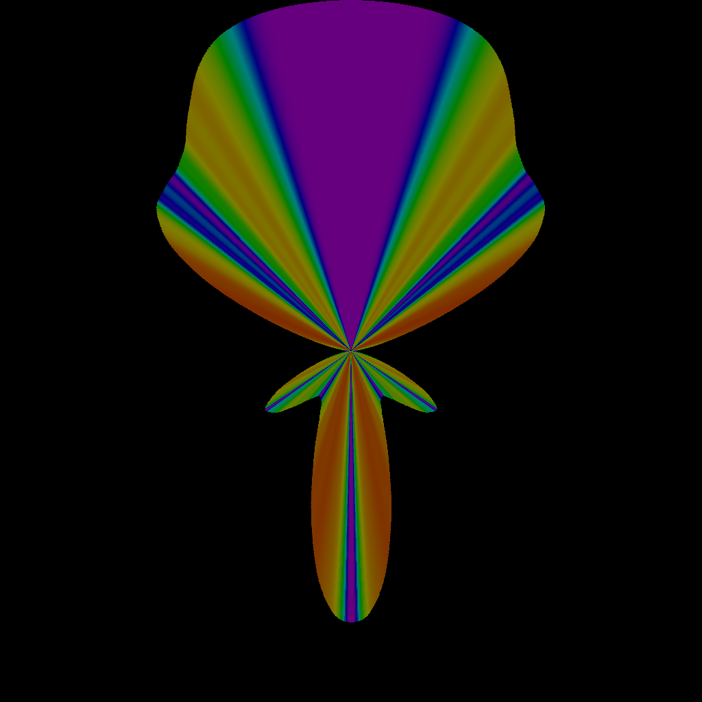

Finally, all the sound samples are assembled together:

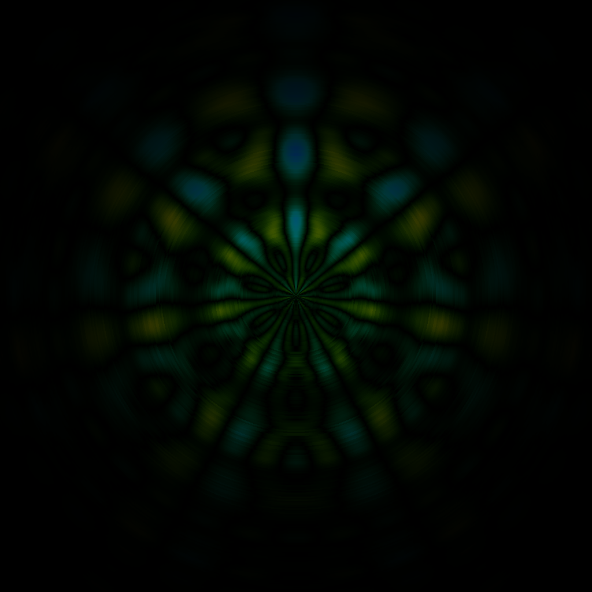

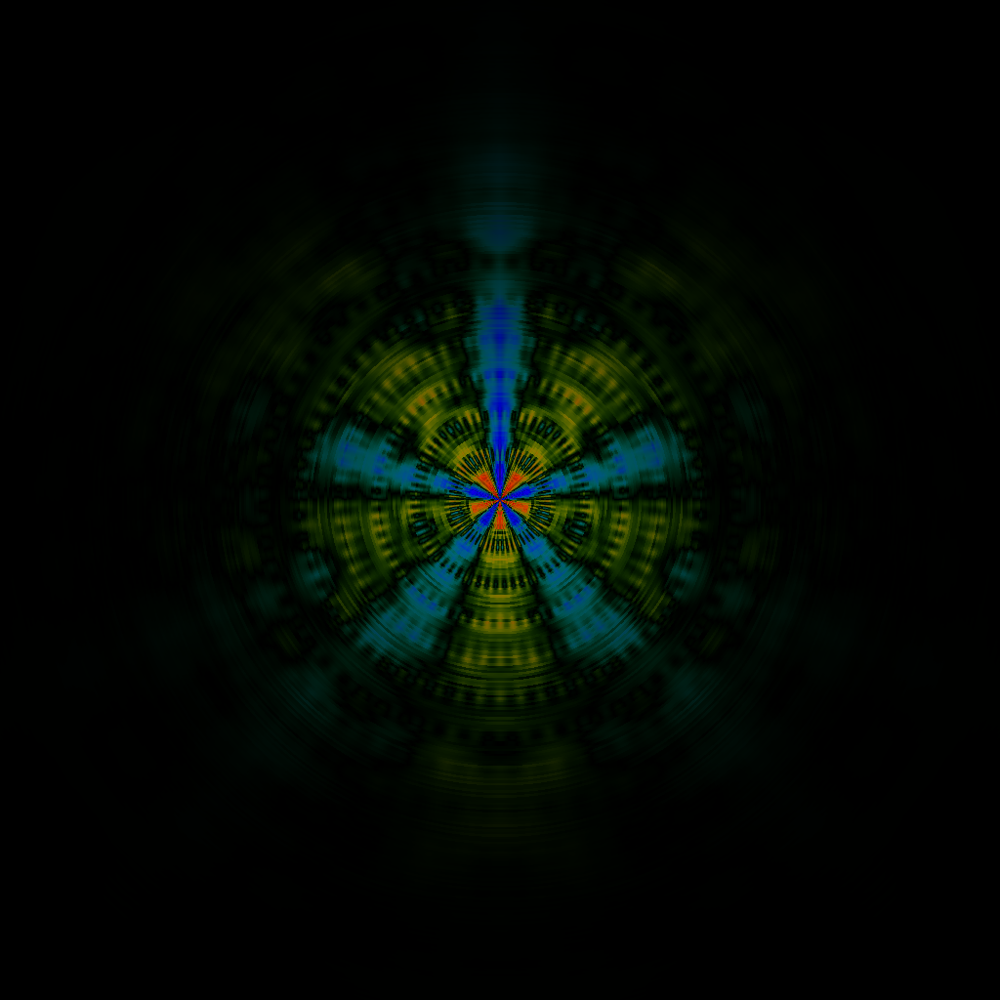

# Visualizing the FFT phase

ACF drops the phase component. However the phase can be extracted from the first FFT and mixed with the ACF shape. On the examples below, the radial coordinate is the ACF value, while color is the FFT phase. The first image is a 20 ms sample of conventional music, while the next two images are bird songs. The phase appears mostly continuous, with sudden jumps in certain places. The discontinuities might be caused by rounding errors in the FFT algorithm, but I haven't looked into this deeper.


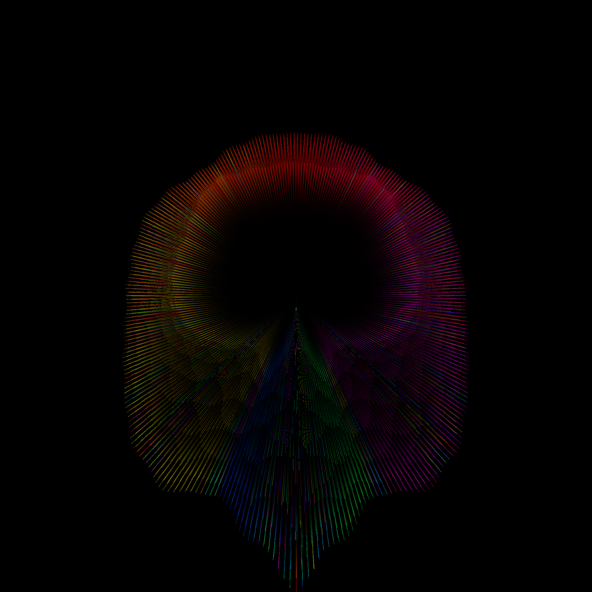

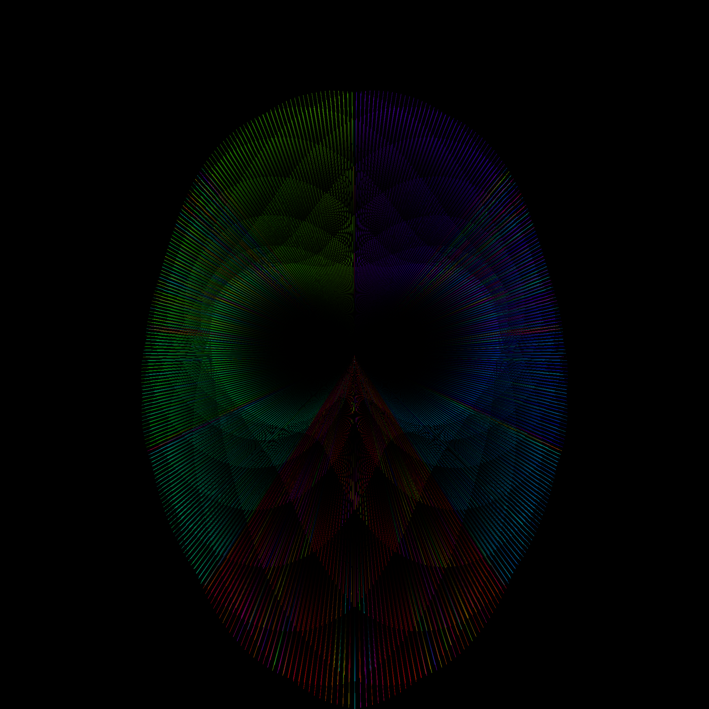

# How I came up with this idea

I've reverse-engineered those "mandala" images, essentially. I've been looking at them and thinking that their symmetric structure is somehow related to symmetry in proper sound.

- The 1st obvious observation is that a mandala is drawn in polar coordinates and is `2*PI` periodic.
- The 2nd observation is that the radial coordinate corresponds to time, while the angular coordinate corresponds to sound frequencies.
- The 3rd observation is that if we take a tiny circular slice of a mandala `|r - r0| < eps`, and look at that circle as a `2*PI` periodic function of sound samples, we could trivially make it audible. The `2*PI` periodic structure will make the produced sound a combination of pure sinusoidal tones.

How would you extract periodic patterns from a short 20 ms sample of sound and assemble them back into a `2*PI` periodic function? You'd take FFT of the 20 ms sample of sound, take magnitudes of the result, and combine the magnitudes back into a mix of sinusoidal waves with the inverse FFT. That's exactly what ACF is doing. And the nice property of FFT is that it can be computed in `N*log(N)` time.

# Questions?

Just open an issue in [github.com/soundshader](https://github.com/soundshader/soundshader.github.io).

# License

AGPLv3
