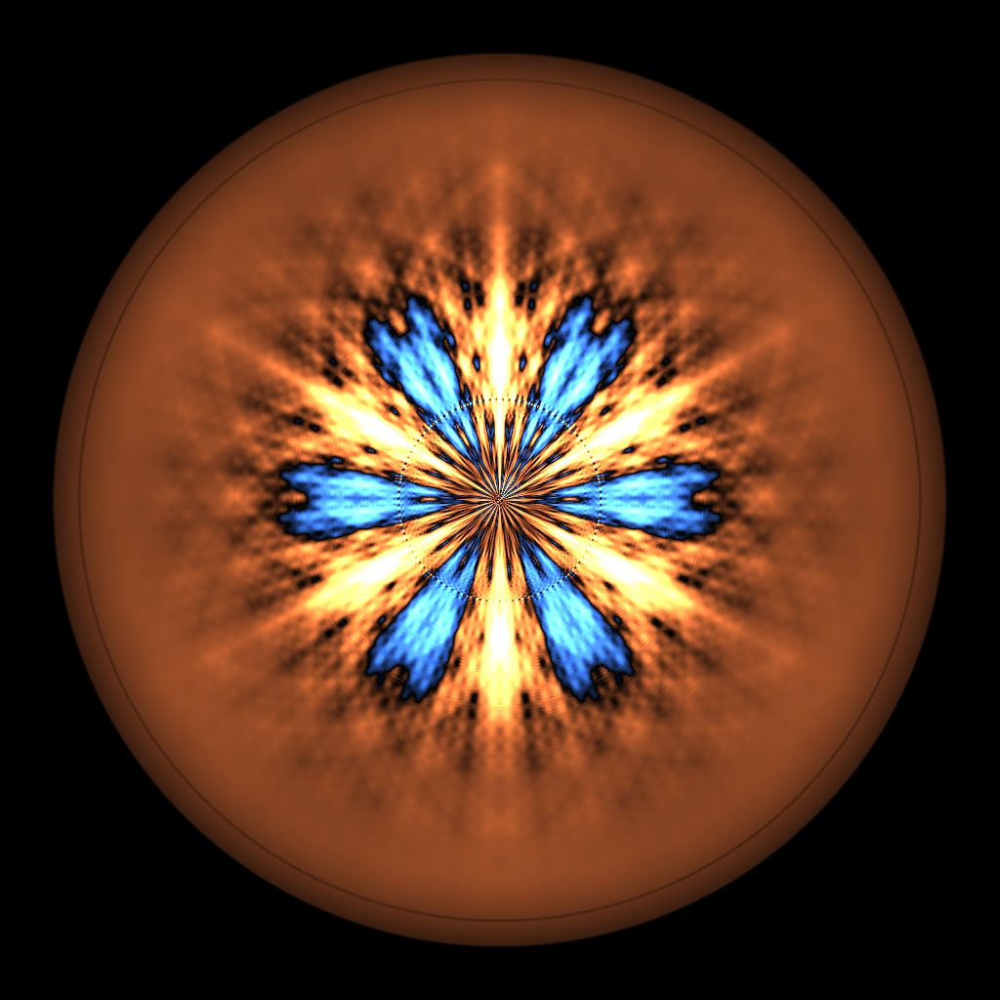
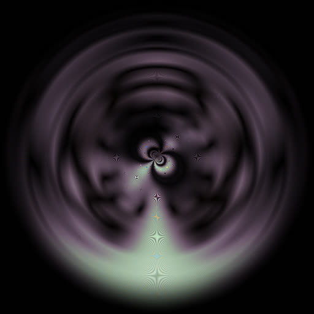
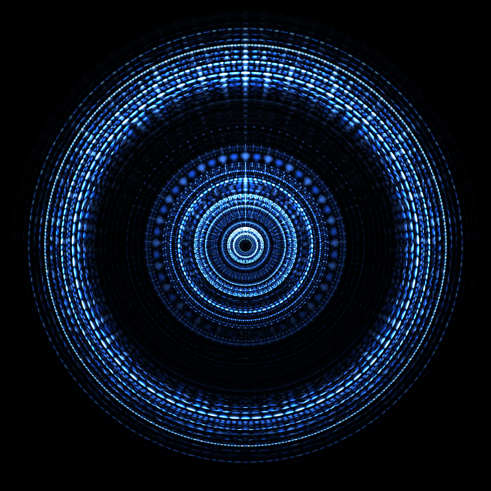
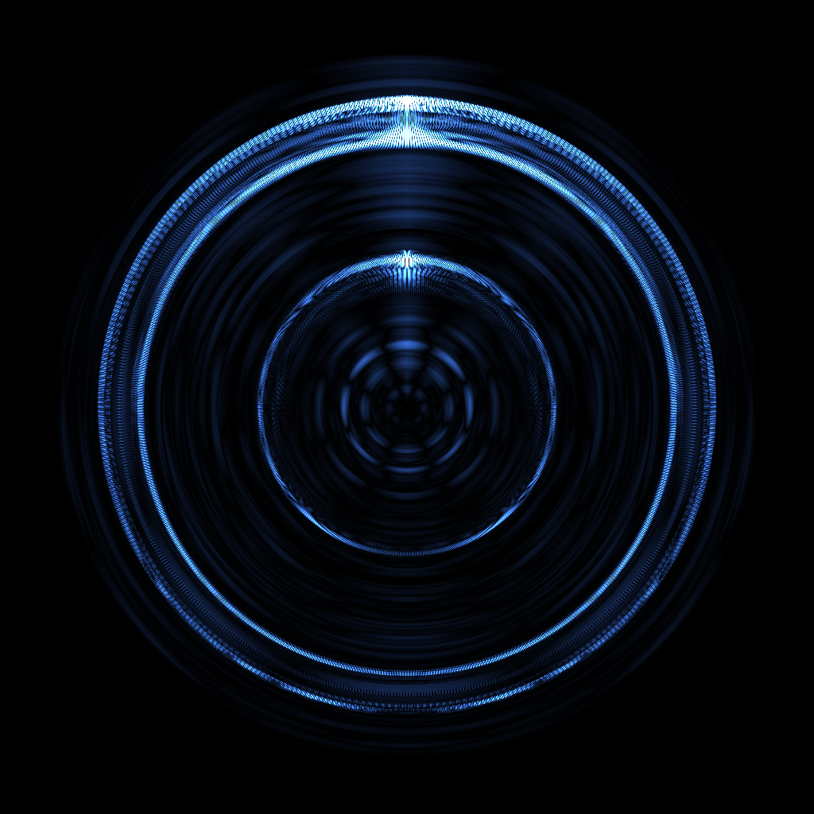
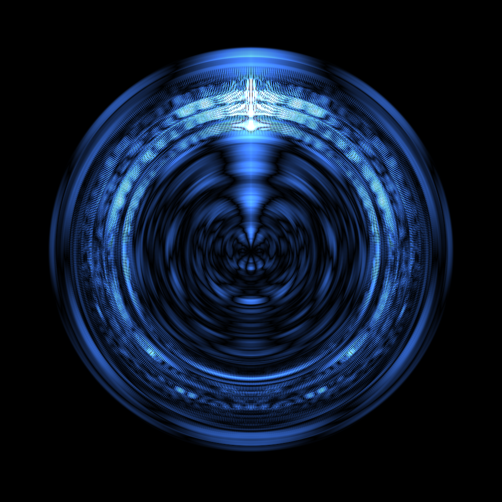
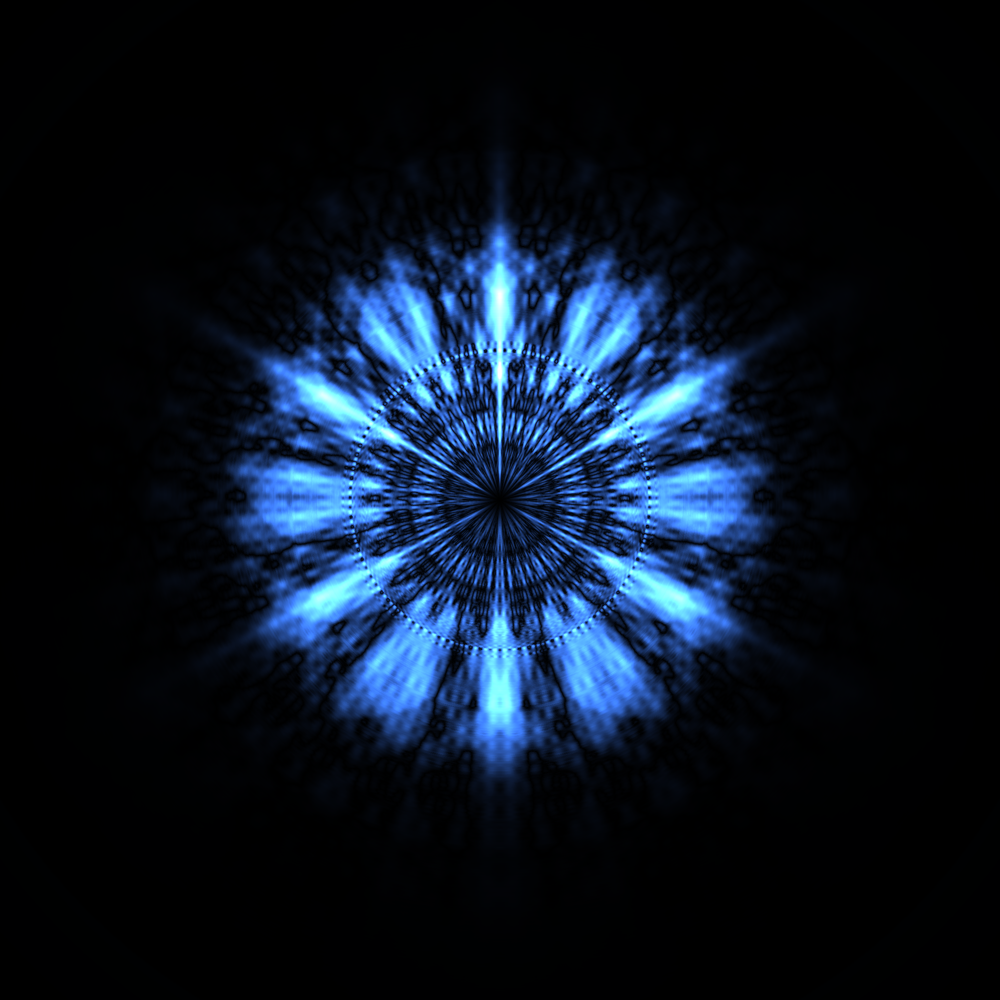
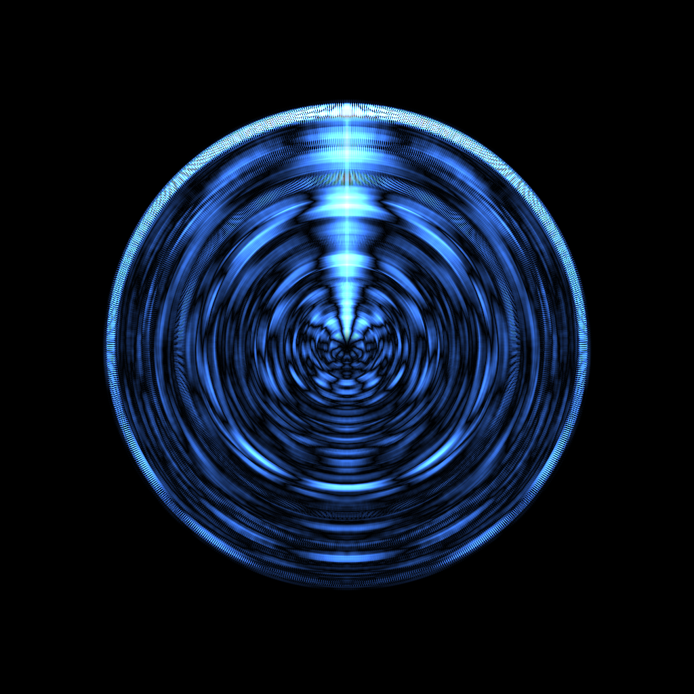
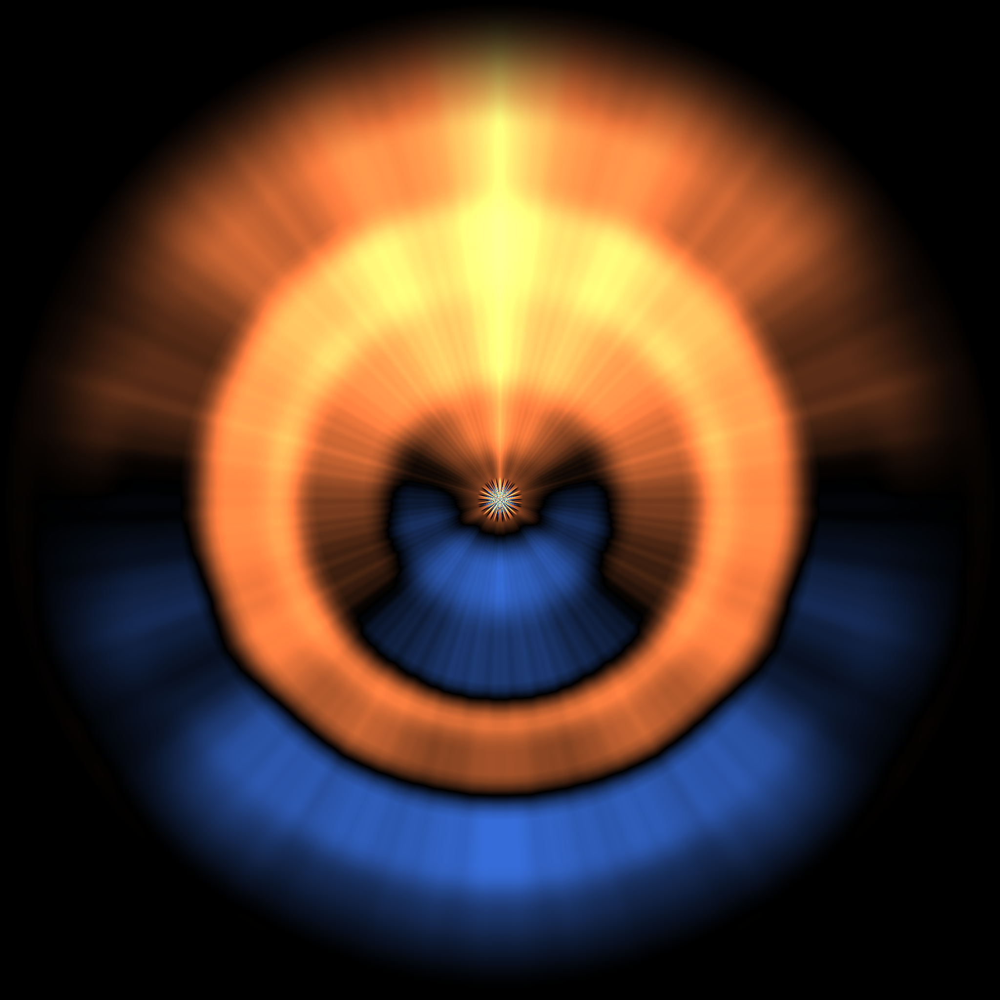
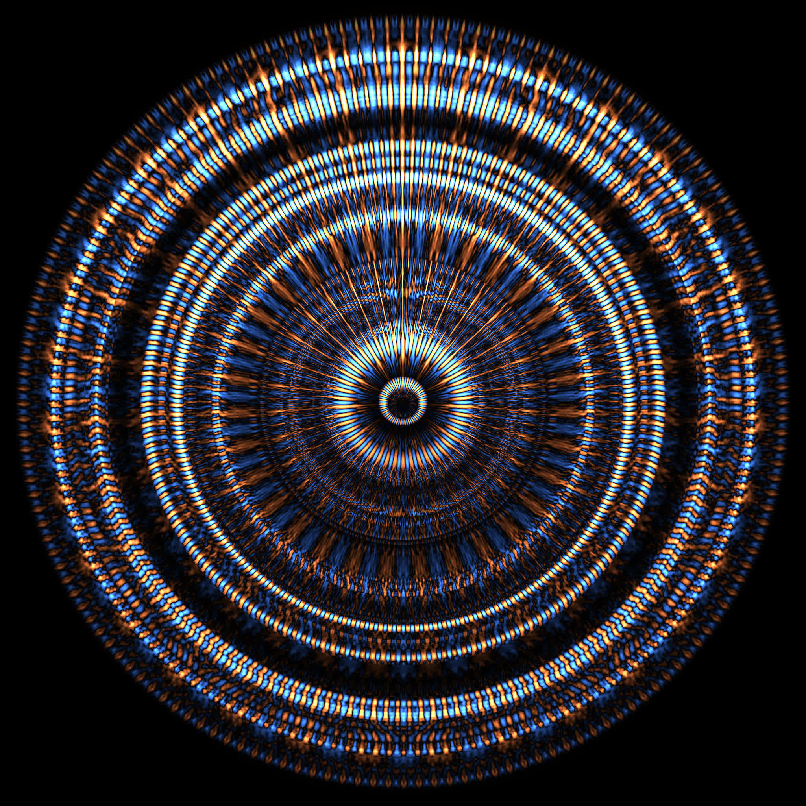

# Some ACF images

Different images use slightly different coloring schemes. Usually, linear mapping of ACF values to color brightness produces the best results, but in a few cases I had to use a more sophisticated scheme to capture a mix of too low and too high ACF values, which often happens in loud club music. The only reason a coloring scheme is needed at all is the very limited brightness range of LCD monitors: those generally can't display pixels that differ in brightness 10,000 times.

 A | B  | C  | D
-- | -- | -- | --
 |  |  | 
 |  |  | 
 |  |     | 
 |  | |

# Some ACF videos

A few recorded videos below use the same coloring scheme except that they assign blue colors to negative ACF values and yellow colors to positive ACF values. The brightness is still determined by the absolute value of ACF.

- [Bowl](../vids/bowl.webm). That's perhaps the archetypical sound that demonstrates the sound frequency as the N-fold rotational symmetry, amplitude modulations as radial waves and phase modulation as the smooth change in shape along the time axis.
- [Muted mic](../vids/mic.webm). There is an unused mic jack on my laptop. Turns out, it still produces barely audible sound of a quite elaborate shape. The amplitude modulations (radial waves) are inaudible, just as the mix of frequencies, but they can be seen.
- [Wren](../vids/wren.webm)
- [Warbler](../vids/warbler.webm)
- [Vivaldi](../vids/vivaldi.webm)
- [Parsons](../vids/parsons.webm). That's my favorite example so far.
- [Quake II](../vids/quake2.webm)
