# Highres spectrograms with the DFT Shift Theorem

Demo: https://soundshader.github.io/hss

A typical FFT-based spectrogram uses 1024 bins on a 48 kHz audio, with about 50 Hz step per pixel. Most of the interesting audio activity happens below 3 kHz, so 50 Hz per pixel gives only 60 pixels for that area. As a result, the spectrogram is pixelated. One way to get highres spectrograms is to use CWT (continuous wavelet transform), but it's messy to implement. Another trick is to use regular FFT shifted by 1/2 pixel (by 25 Hz): the [DFT Shift Theorem](https://en.wikipedia.org/wiki/Discrete_Fourier_transform#Shift_theorem) enables such frequency shifting by multiplying the input signal by `exp(-i*pi*k/N)`. Smoothness in the time direction is easier to achieve: the 1024 bins window can be advanced by arbitrarily small time steps.

Images below use an HSV-based color scheme:
- H is the weighted sum of the rainbow palette where log-scaled FFT amplitudes are weights.
- S is `1.0 - FFT[i]^2 / max FFT^2`, i.e. the max FFT amplitude has 0 saturation, i.e. white.
- V is the log-scaled FFT amplitude.

## Bird songs

Bird songs recordings were taken from www.fssbirding.org.uk/sonagrams.htm. Unlike musical instruments, birds don't seem to bother to create a complex multi-layered harmonics pattern. Instead, they create a complex pattern with the base (fundamental) frequency alone. The "cloud" above the main drawing is what would be the 2nd harmonic. These sonograms are remarkably different from other sounds, as if birds "draw" with sound something that's flying backwards in time.

[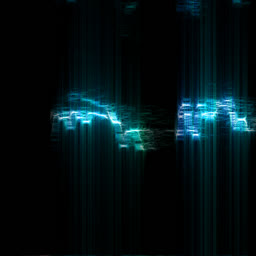](gallery/bird/1.png)
[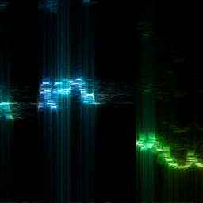](gallery/bird/2.png)
[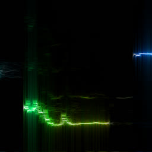](gallery/bird/3.png)
[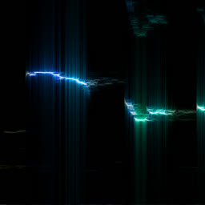](gallery/bird/4.png)
[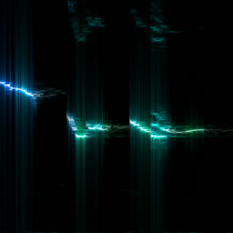](gallery/bird/5.png)
[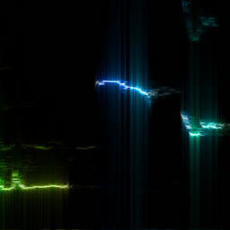](gallery/bird/6.png)
[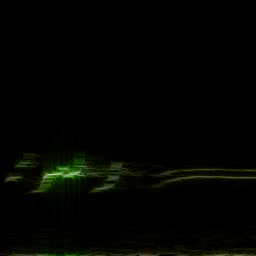](gallery/bird/7.png)

[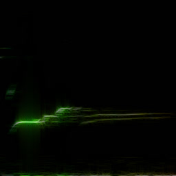](gallery/bird/9.png)
[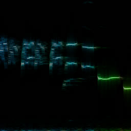](gallery/bird/10.png)
[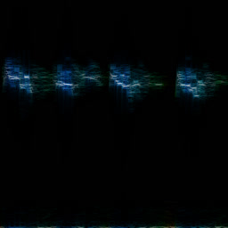](gallery/bird/11.png)
[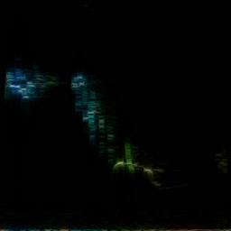](gallery/bird/12.png)

[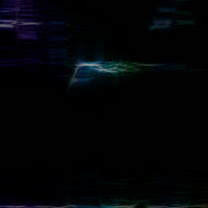](gallery/bird/14.png)

## Bongo

[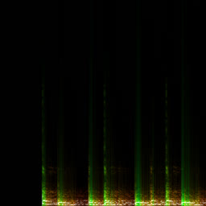](gallery/bongo/1.png)
[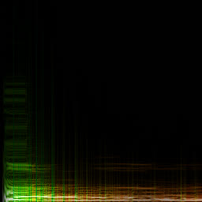](gallery/bongo/2.png)
[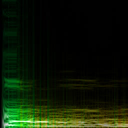](gallery/bongo/3.png)

## Flute

Musical instruments usually have this multi-level harmonics structure. Flute is one of the simplest instruments, with first 2 harmonics dominating the spectrum. However it would be a mistake to to call flute sound simple: as you see, every level has its own regular pattern that can't be recreated with a simple mix of sinusoidal tones.

[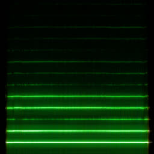](gallery/flute/1.png)

## Guitar

[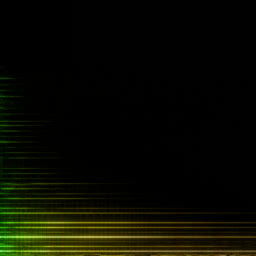](gallery/guitar/1.png)
[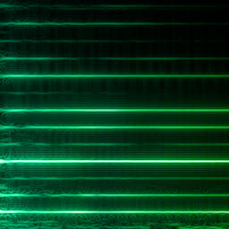](gallery/guitar/2.png)

## Piano

[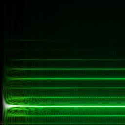](gallery/piano/2.png)

## Violin

Viloin is the most instresting: on levels 8 and 9 it creates an intricate ornament. I don't know if it's a feature or a defect of the instrument. It's interesting that our ears collapse the entire 20-story harmonics tower with all these different ornaments on different floors into a single tone.

[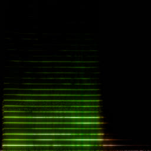](gallery/violin/1.png)
[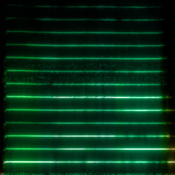](gallery/violin/2.png)
[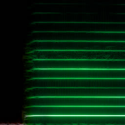](gallery/violin/3.png)

[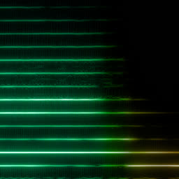](gallery/violin/5.png)

## Voice

The bright lines are vowel formants: a pair or triple of them uniquely identify a vowel. Each greenish column is a word, usually consisting of two vowels. The horizontal bar is a bell. Vowels have pretty complex structure and look like a mix of bird songs with musical instruments, as they also have harmonics.

[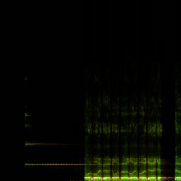](gallery/voice/1.png)
[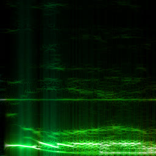](gallery/voice/2.png)

