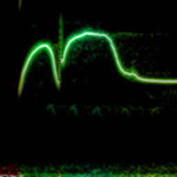
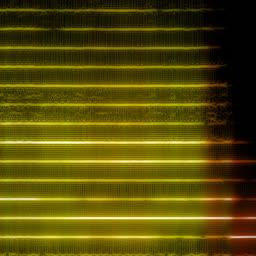
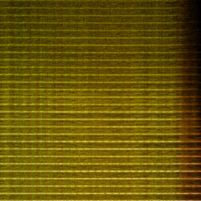
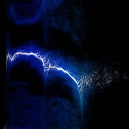
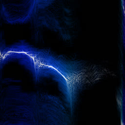
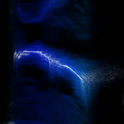
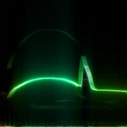
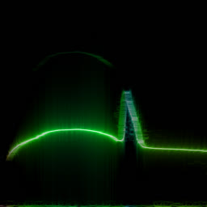
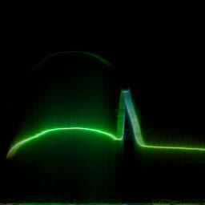

# Wigner transform for dummies

GitHub: https://github.com/soundshader/soundshader.github.io

Demo: https://soundshader.github.io/hss?wdf=1 (You'll need to skillfully use keys WASD and QERF to move around and zoom-in/zoom-out).

As I was looking for interesting audio transforms, I came across the [Wigner distribution function](https://en.wikipedia.org/wiki/Wigner_distribution_function) (or just WDF). The example on Wikipedia looks indeed interesting and it's "sold" as a function that "provides the highest possible temporal vs frequency resolution which is mathematically possible within the limitations of the uncertainty principle" and thus "when a signal is not time limited, its WDF is hard to implement." Turns out, WDF isn't much harder to implement than plain FFT.

The definition of WDF is this:


It does an interesting trick: at every point in time it inverts the audio signal and multiplies it by its normal time-forward version. This makes sense because a periodic signal at time T would locally correlate with a time inverted version of itself, however in WDF this correlation isn't time bounded, so if the signal is 1 hour long, WDF will multiply two one hour long signals to compute just one value at T. This seems meaningless at first glance, as the random contributions 30 mins away from the current moment would make WDF random, but a closer look reveals that if those far away contributions are indeed random, they would cancel out each other, and they do (to an extent). The complex exponent on the right is effectively the usual FFT on the forward-inverted correlation.

In practice, this means a simple algorithm to compute WDF:

1. Take N samples at the current moment: `x[1..N]`
1. Apply the Hann window to approximate cancellation of far-away terms.
1. Multiply it by the reversed copy of itself: `y[1..N] = x[1..N] * x[N..1]`
1. Stretch it to account for `x(t+tau/2)` in the formula above: `y[1..N/2] -> z[1..N]`
1. Compute the usual `Z = FFT[z]`

So it doesn't really add any complexity on top of the regular FFT. In practice, though, WDF is an extremely noisy function that's much less insightful than plain FFT. Below is the same bird recording ([xeno-canto.org/33539](https://www.xeno-canto.org/33539)) visualized with different methods. 

1. [CWT](https://en.wikipedia.org/wiki/Continuous_wavelet_transform) with the [Morlet](https://en.wikipedia.org/wiki/Morlet_wavelet) wavelet.
2. FFT with the [Hann window function](https://en.wikipedia.org/wiki/Window_function#Hann_and_Hamming_windows). This is practically equivalent to CWT, as the latter is more or less the same as FFT with the slightly different [Gaussian window](https://en.wikipedia.org/wiki/Window_function#Gaussian_window). And unlike CWT, computing FFT doesn't involve any mental gymnastics.
3. Plain FFT spectrogram with 1024 bins at 48 kHz. Pixelated because only 300 or so bins capture the useful 0..8 kHz range.
4. "Continuous FFT" spectrogram that uses the [DFT Shift Theorem](index.html) and the usual rectangular window function which produces these sinc-shaped diffraction patterns.
5. WDF with the Hann window on 2048 samples per frame.

[](comp/cwt.png)
[](comp/hann.jpg)
[](comp/fft-1.png)
[](comp/fft-2.png)
[](comp/wdf.jpg)

WDF is able to produce interesting spectrograms sometimes, but in most cases it's unusably noisy. Unlike FFT spectrograms, WDF gets more precise on larger windows: frequency lines get thinner, at the expense of adding more noise around them. Below is the same violin sample: an FFT spectrogram, and two WDF spectrograms with 2048 and 4096 samples per frame.

[](wdf/v-fft.jpg)
[](wdf/v-wdf.jpg)
[](wdf/v-wdf-2.jpg)

Some bird examples: WDFs with 2048, 4096 and 8192 samples per frame.

[](wdf/wdf-2.jpg)
[](wdf/wdf-5.jpg)
[](wdf/wdf-6.jpg)

## Appendix

I've accidentally discovered that a lazy `ffmpeg -i bird.mp3 bird.ogg` produces audio artifacts. Even though they are inaudible, they can be easily seen on spectrograms.

The original mp3 (libvorbis) and transcoded ogg (default libvorbis, `-compression_level 10`):

[](bird/16.png)
[](opus/vorbis.jpg)
[](opus/vorbis10.jpg)

Transcoded ogg (default libopus, `-b:a 48k`, `-b:a 48k -compression_level 10` and just `-compression_level 10`):

[](opus/opus.jpg)
[](opus/opus-48k.jpg)
[](opus/opus-48k-comp10.jpg)
[](opus/opus-comp10.jpg)

The interesting conclusion is that specifying the correct bitrate (48k) achieves the highest quality and the smallest file size as a bonus. Even the additional "best compression" option has no visible effect. Just `-compression_level 10` produces artifacts, as ffmpeg sets bitrate to 64k for some reason. I couldn't get `-codec:a libvorbis` to produce a good result. It must work somehow as libvorbis is used in the mp3 file, but I couldn't figure the right set of ffmpeg options. Here's the winner command line:

```
ffmpeg -i XC33539.mp3 -codec:a libopus -b:a 48k XC33539.ogg
```
