# Vowels as colored ACF images

[https://en.wikipedia.org/wiki/Table_of_vowels](https://en.wikipedia.org/wiki/Table_of_vowels)

Each picture below corresponds to a vowel from the table above. If a picture is missing, it's because Wikipedia doesn't provide a audio file for that vowel. How are these pictures generated? By creatively transforming FFT of the audio file. Rougly speaking, the radial coordinate corresponds to time, the angular coordinate corresponds to frequency and color correponds to [pitch](https://en.wikipedia.org/wiki/Pitch_%28music%29) or musical note. Pictures are reversible: they contain enough information to recreate the original audio. If you want to listen to audio, find the corresponding vowel in the Wikipedia table.

Questions or ideas? My email: 𝛓𝛓𝖌𝖍@𝝁𝝁·𝛓𝛕 (use latin letters to type it).

## Unrounded vowels

 . | Front | Central | Back
-- | ----- | ------- | ----
Close | [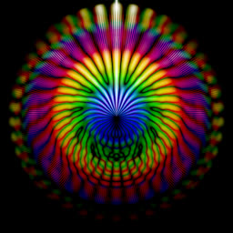](pics/rgb/cfu.jpg) | [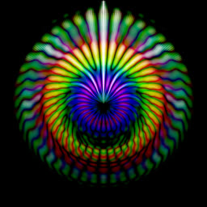](pics/rgb/ccu.jpg) | [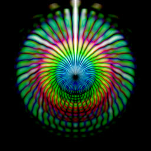](pics/rgb/cbu.jpg)
Near-close | [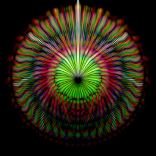](pics/rgb/ncnfu.jpg) | | 
Close-mid | [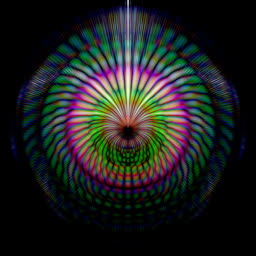](pics/rgb/cmfu.jpg) | [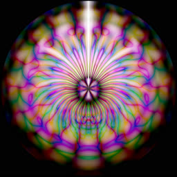](pics/rgb/cmcu.jpg) | [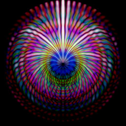](pics/rgb/cmbu.jpg)
Mid | | [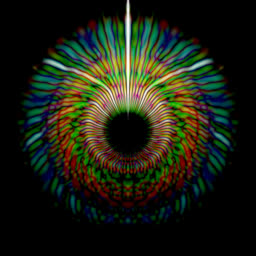](pics/rgb/mc.jpg) |
Open-mid | [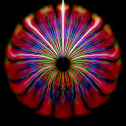](pics/rgb/omfu.jpg) | [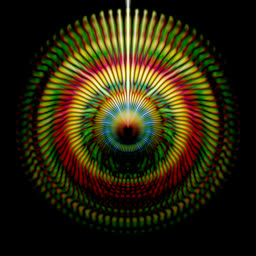](pics/rgb/omcu.jpg) | [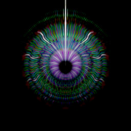](pics/rgb/ombu.jpg)
Near-open | [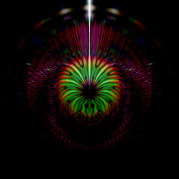](pics/rgb/nofu.jpg) | [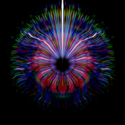](pics/rgb/nocu.jpg) |
Open | [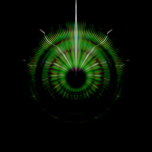](pics/rgb/ofu.jpg) | [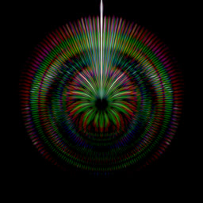](pics/rgb/ocu.jpg)  | [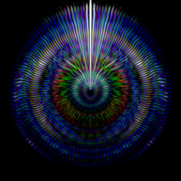](pics/rgb/obu.jpg)

## Rounded vowels

 . | Front | Central | Back
-- | ----- | ------- | ----
Close | [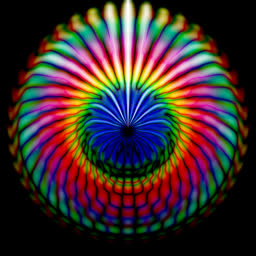](pics/rgb/cfr.jpg) | [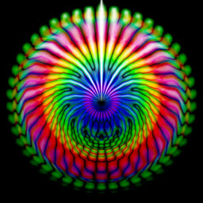](pics/rgb/ccr.jpg) | [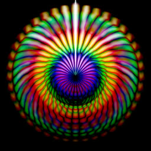](pics/rgb/cbr.jpg)
Near-close | [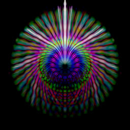](pics/rgb/ncnfr.jpg) | | [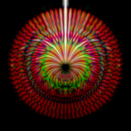](pics/rgb/ncnbr.jpg)
Close-mid | [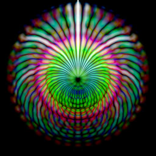](pics/rgb/cmfr.jpg) | [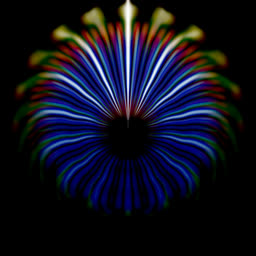](pics/rgb/cmcr.jpg) | [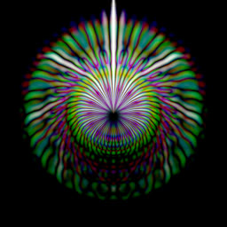](pics/rgb/cmbr.jpg)
Mid | |  |
Open-mid | [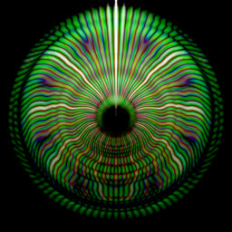](pics/rgb/omfr.jpg) | [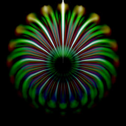](pics/rgb/omcr.jpg) | [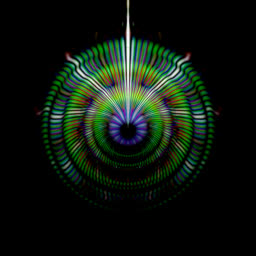](pics/rgb/ombr.jpg)
Open | [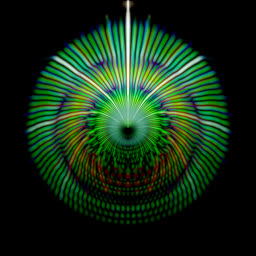](pics/rgb/ofr.jpg) |  | 

## Other sounds

An annoyed and an angry cat:

[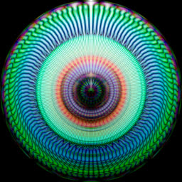](pics/rgb/cat_demand.jpg) [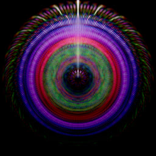](pics/rgb/cat_anger.jpg)

Singing birds:

[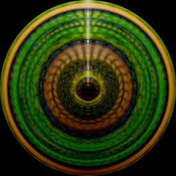](pics/rgb/birds.jpg)

## Notes

https://soundshader.github.io/hss/?alog=4&bins=4096&cw=2048&ch=2048